# Операционные системы UNIX/Linux (Основы).
Установка и обновления системы Linux. Основы администрирования.

## Часть 1. Установка ОС

- Установлена Ubuntu 20.04 Server LTS без графического интерфейса. (с использованием программы для виртуализации - VirtualBox)
- Информация о текущей ОС получается командой: \
`cat /etc/issue`
\
\
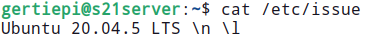

## Часть 2. Создание пользователя

- Новый пользователь в Linux создается командой: \
  `sudo useradd username`
\

- Убедиться в том, что пользователь действительно создался можно командой: \
  `cat /etc/passwd | grep -e "s21_user"` \
  \
  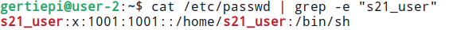
- Добавить пользователя в группу `adm` можно командой `sudo usermod -aG adm s21_user` \
  \
  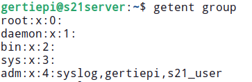
## Часть 3. Настройка сети ОС

- Изменение названия машины производится за счет редактирования файла `/etc/hostname`, т.к. там содержится его название.  
`echo "user-1" > /etc/hostname` \
\
  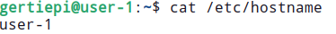

- Установить временную зону можно с помощью команды: \
  `timedatectl set-timezone Europe/Moscow`  
 
  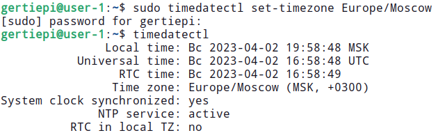

- Для работы с сетевым окружением в ubuntu используется утиллита net-tools. Установим её командой \
`sudo apt install net-tools`
- Теперь мы можем просмотреть нашу сетевую конфигурацию, используя команду `ifconfig` \
  \
  

 - Интерфейс loopback (`lo`) является особенным сетевым интерфейсом в Linux. Он представляет собой виртуальный интерфейс, который позволяет устройству обращаться к самому себе через сетевой стек. Вместо отправки данных по физической сети, данные, отправленные через интерфейс loopback, остаются на уровне операционной системы и немедленно возвращаются обратно. В целом, интерфейс loopback в Linux является важным инструментом для локальной коммуникации и отладки сетевых приложений, предоставляя возможность взаимодействия с самим устройством без использования физической сети.
 - DHCP расшифровывается как "Dynamic Host Configuration Protocol", что в переводе на русский означает "Протокол динамической конфигурации хоста". DHCP является сетевым протоколом, который позволяет компьютерам и другим устройствам автоматически получать IP-адреса и другую сетевую конфигурацию, необходимую для подключения к сети.
 - Для получения `ip` адреса устройства, с которого ведется работа от DHCP сервера требуется снала сбросить старый `ip` через `sudo dhclient -r enp0s3`, где `enp0s3` - наш сетевой протокол из вывода `ifconfig`. \
Снова выводим доступные сети ifconfig-ом: \
\
    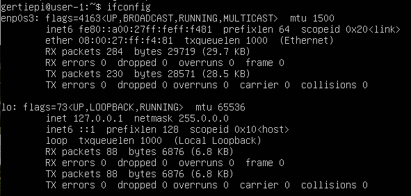

- Видно что, ip-адрес отсутствует. Получим новый командой `sudo dhclient -v enp0s3`: \
\
  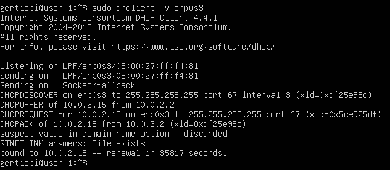

- С помощью команды `ifconfig` можно убедиться, что `ip` успешно получен: \
  \
    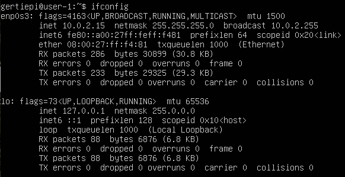
- Используя команду `wget -q -O - ifconfig.me/ip` можно узнать свой внешний `ip`, обратившись к внешнему сайту, `wget` позволяет делать запросы в интернет из терминала: \
  \
  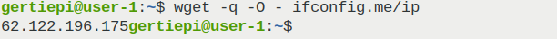

- Внутренний `ip` (gateway) можно узнать командой `route -n` - в столбце Gateway будет искомый адрес: \
\
  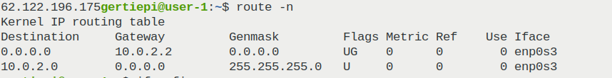

- Для настройки статического `ip` необходимо редактировать конфигурационный файл `/etc/netplan/00-installer-config.yaml` который хранит параметры сетевых интерфейсов: \
\
  

- Требуется первоначально отключить автоматическое получение адресов от `DHCP` и ниже добавляем строки с желаемыми `ip`, шлюзом и DNS-серверами: \
\
  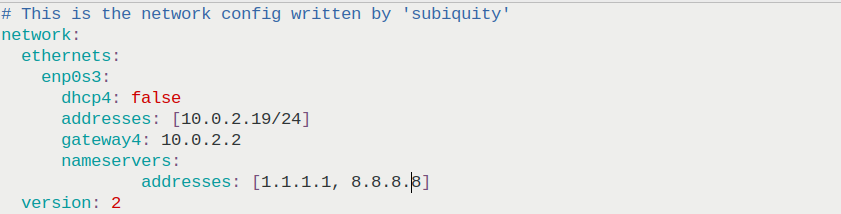

- Для приминения изменений вводятся команды `netplan apply` и `netplan try`, для проверки измененной конфигурации вызовем команду `ifconfig`: \
  \
  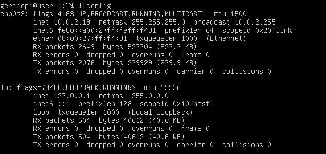

- Убедиться в роботоспособности настроенной сети и выхода в интернет можно при помощи команды `ping`: \
  \
 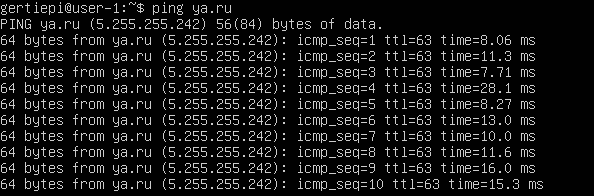
 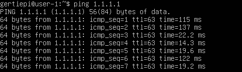

## Часть 4. Обновление ОС
- Для обновления списка репозиториев используется команда `apt update`
- Для обновления версии пакетов используется команда `apt dist-upgrade` \
\
 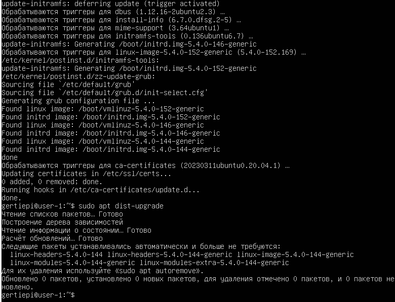

## Часть 5. Использование команды sudo

- Команда sudo в Linux используется для выполнения команд от имени суперпользователя (root) или другого пользователя с повышенными привилегиями. Акроним sudo расшифровывается как "Superuser Do" или "Substitute User Do" (в зависимости от источника).Истинное назначение команды sudo заключается в предоставлении временных привилегий аутентифицированным пользователям, чтобы они могли выполнять определенные команды, которые требуют повышенных привилегий, без необходимости постоянного входа в систему под учетными данными суперпользователя.Когда команда выполняется с использованием sudo, система проверяет, имеет ли текущий пользователь право выполнять эту команду в файле конфигурации sudoers. Если у пользователя есть соответствующие разрешения, ему предоставляются временные привилегии для выполнения команды суперпользователя. При этом пользователю может потребоваться ввести свой пароль для подтверждения авторизации. Использование команды sudo помогает повысить безопасность системы, поскольку она ограничивает доступ к привилегированным операциям только аутентифицированным пользователям и в то же время предотвращает постоянное вход в систему под учетными данными суперпользователя, что снижает риск нежелательных изменений или ошибок, вызванных неосторожным использованием привилегий суперпользователя.
- Для предоставления пользователю прав на выполнение команды `sudo` требуется настроить конфигурационный файл `/etc/sudoers`, в котором хранится вся информация о привилегиях.
- Права можно предоставить записав `s21_user ALL=(ALL:ALL) ALL` в `/etc/sudoers`: \
 \
  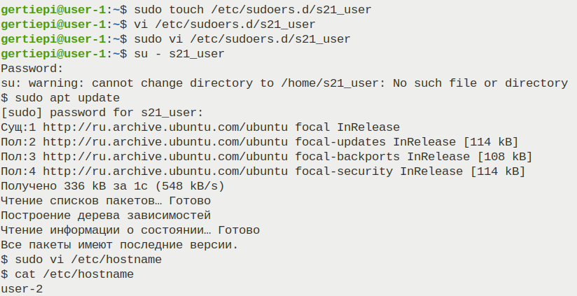

## Часть 6. Установка и настройка службы времени
- За настройку времени отвечает сервис `timedatectl` \
  \
   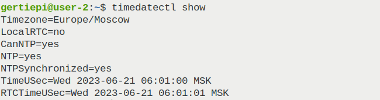
## Часть 7. Установка и использование текстовых редакторов

- Редактирование с сохранением изменений, выбраны редакторы: `vim`, `nano`, `joe`:
- vim - для выхода с сохранением изменений используется команда `:wq`, для выхода без сохранения  `:q!`\
  \
  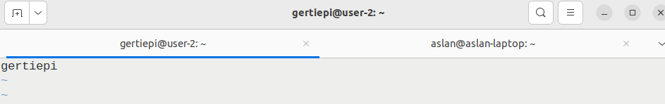 
- nano - для выхода с сохранением изменений используется команда `control+X` \
  \
  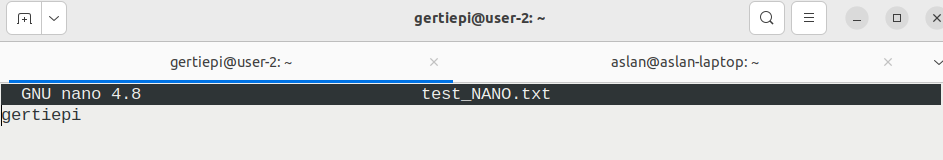

- joe - для выхода с сохранением изменений используется команда `control+K X`, для выхода без сохранения  `control+K` \
    \
  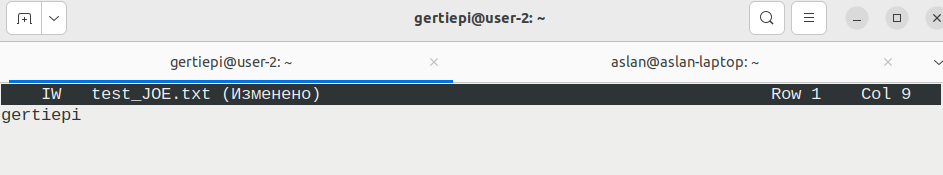

- В Vim есть несколько функций для поиска по содержимому файла и замены слов. Вот некоторые из них:

1. Поиск слова:
   - В режиме команд наберите `/` и затем введите искомое слово, например: `/слово`. Затем нажмите Enter. Vim перейдет к первому найденному совпадению.
   - Для перехода к следующему совпадению используйте команду `n`, а для перехода к предыдущему - `N`.

2. Замена слова:
   - В режиме команд наберите `:%s/искомое_слово/заменяемое_слово/g`, где `%` означает применение к каждой строке, `s` - замена, `/искомое_слово/` - искомое слово, `/заменяемое_слово/` - слово, на которое будет заменено, а `g` - флаг, указывающий на замену всех совпадений в строке.
   - Нажмите Enter, чтобы выполнить замену первого совпадения в каждой строке.
   - Чтобы выполнить замену всех совпадений в каждой строке без подтверждения, используйте флаг `g` без подтверждения. Например: `:%s/искомое_слово/заменяемое_слово/gc` (где `c` означает подтверждение).

3. Замена всех совпадений без подтверждения:
   - В режиме команд наберите `:%s/искомое_слово/заменяемое_слово/gc`.
   - Нажмите Enter, чтобы выполнить замену первого совпадения в каждой строке.
   - После каждого совпадения Vim предложит вам выбор: заменить или пропустить. Нажмите `y`, чтобы заменить текущее совпадение, или `n`, чтобы пропустить.

## Часть 8. Установка и базовая настройка сервиса SSHD

- Для настройки и использования службы удаленного доступа `sshd` требуется ее скачать командой `apt install ssh` 
- Настроить автостарт определенного сервиса или службы можно командой `systemctl enable ssh`: \
 \
   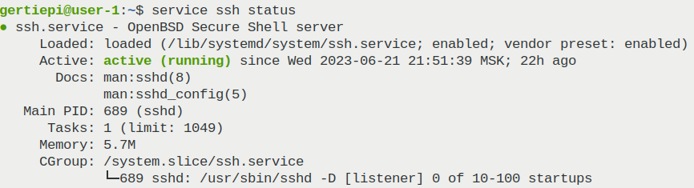

- Конфигурация службы `sshd` хранится в файле `/etc/ssh/sshd_config`, там нужно перенастроить порт с `22` на `2022`. \
  \
  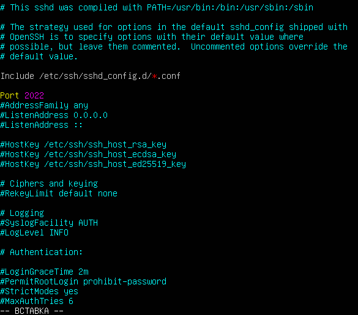

-  Далее разрешаем как логин по ключу, так и логин по паролю.
-  Для вступления изменений в силу перезагружаем службы командой `service ssh restart`
-  Также требуется настроить фаервол, это можно сделать командой `ufw enable` затем `sudo ufw allow 2022`: \
  \
  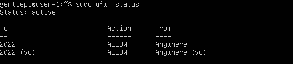
    
-  После всех настроек можно подключиться к серверу с удаленной машины командой `ssh username@localhost -p 2022`: \
  \
  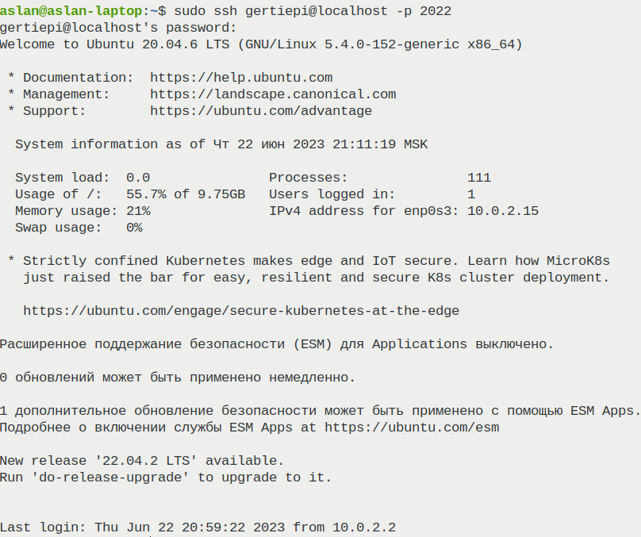
- Используя команду `ps aux | grep sshd` можно наглядно увидеть наличие процесса `sshd`: \
  \
  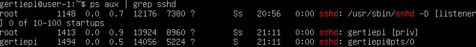   \
\
В команде `ps aux` аргументы `aux` определяют формат вывода и фильтры для отображения списка процессов. Вот подробное описание каждого аргумента: \
\
 `a`: Отображает процессы, связанные с терминалом (tty) и не связанные с терминалом. Этот флаг позволяет отображать все процессы в системе, включая те, которые не связаны с текущим терминалом. \
\
 `u`: Выводит подробную информацию о процессах, включая имя пользователя (USER), идентификатор процесса (PID), процент использования процессора (%CPU), процент использования оперативной памяти (%MEM), размер виртуальной памяти (VSZ), размер физической памяти (RSS), текущий статус процесса (STAT), время запуска процесса (START) и команду/имя процесса (COMMAND). \
\
 `x`: Отображает процессы, не связанные с терминалом (tty). Этот флаг позволяет отобразить процессы, которые работают в фоновом режиме или не связаны с текущим терминалом. \
\
Сочетание этих аргументов `aux` в команде `ps` позволяет отобразить полный список процессов в системе, включая информацию о пользователях, ресурсах, статусе и командах, связанных с каждым процессом.

- Команда `netstat -tan` используется для отображения списка сетевых соединений и портов на вашей системе. Вот, что означают ключи и параметры этой команды: \
\
`-t`: Отображает информацию о TCP-соединениях. \
\
`-a`: Отображает все соединения и порты, включая прослушивающие порты (listening ports). \
\
`-n`: Отображает номера портов и IP-адреса в числовом формате, а не в виде имен (не выполняет обратное разрешение DNS). \
\
Совместное использование этих ключей `tan` позволяет отобразить список всех активных TCP-соединений на вашей системе, включая номера портов и IP-адреса в числовом формате. \
\
Команда `netstat -tan` часто используется для отладки сетевых проблем и анализа активных соединений. Она позволяет вам проверить, какие порты на вашей системе открыты или заняты, и какие соединения установлены с удаленными хостами по протоколу TCP. \
\
  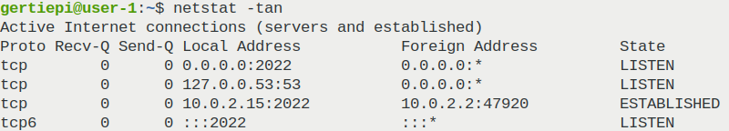\
  \
  В выводе команды `netstat -tan` или подобных команд, строка `0.0.0.0:*` обычно отображается в столбце "Локальный адрес" и указывает на прослушивание всех доступных IP-адресов (любых сетевых интерфейсов) на определенном порту.

- Расшифровка значения `0.0.0.0`:
  IP-адрес `0.0.0.0` представляет собой специальный адрес, который обозначает "любой адрес" или "любой интерфейс" на данной системе.
  В контексте прослушивания порта `0.0.0.0` означает, что сервер прослушивает все доступные IP-адреса на системе, то есть будет принимать входящие соединения на этом порту с любых интерфейсов.
  Знак `*` в столбце "Порт" указывает на то, что порт не является фиксированным или конкретным. Вместо этого, он означает, что используется любой доступный порт на системе.

## Часть 9. Установка и использование утилит top,  htop 

  - Команда `top`: \
\
  
  
| Параметр | Значение |
| --------------------| ------------ |
| uptime | 47 min |
| количество авторизованных пользователей | 2 |
| общую загрузку системы | 0 0 0 |
| общее количество процессов | 99 |
| загрузку cpu | 0 |
| загрузку памяти | 964.9 Mib |
| pid процесса занимающего больше всего памяти | 709 |
| pid процесса, занимающего больше всего процессорного времени | 1136 |

  - Команда `htop` (сортировка по `PID`): \
\
  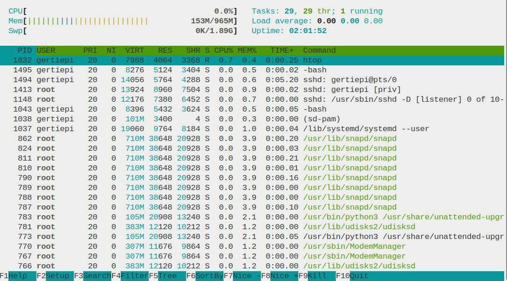
  
  - Команда `htop` (сортировка по `PERCENT_CPU`): \
\
  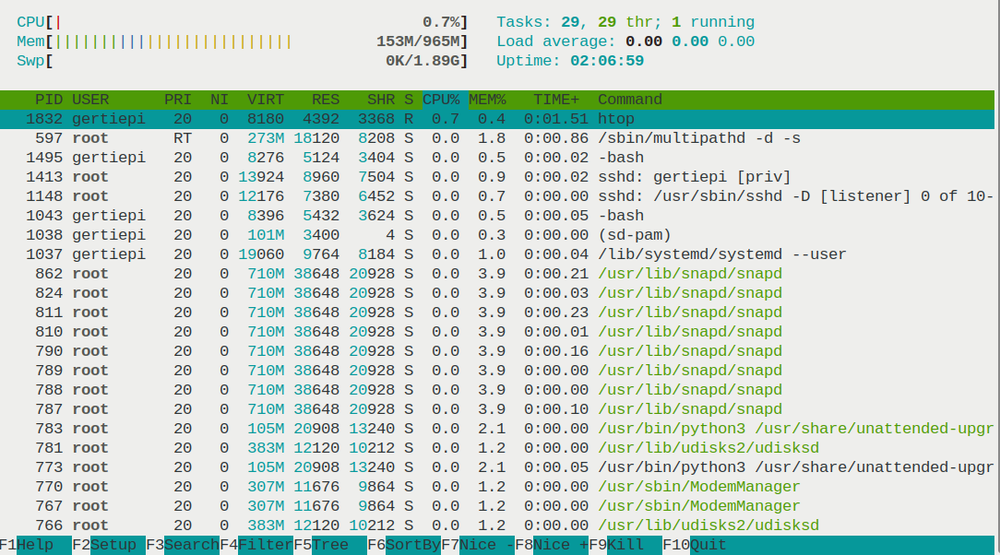
  
  - Команда `htop` (сортировка по `PERCENT_MEM`): \
\
  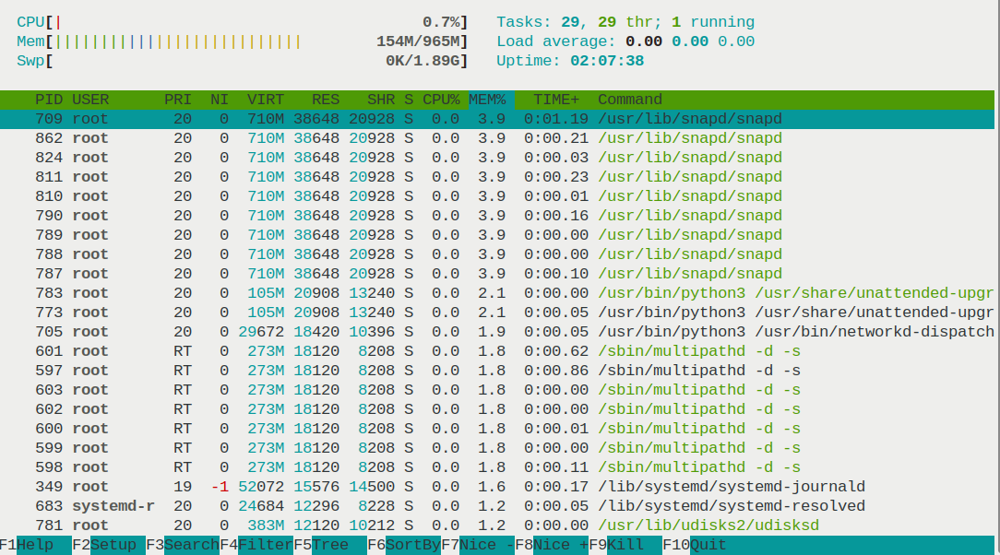
  
  - Команда `htop` (сортировка по `TIME`): \
\
  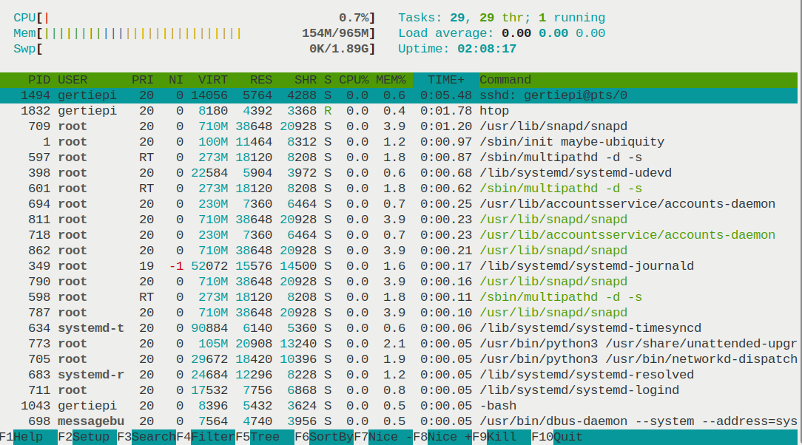

  - Фильтрация для процесса `sshd`: \
\
  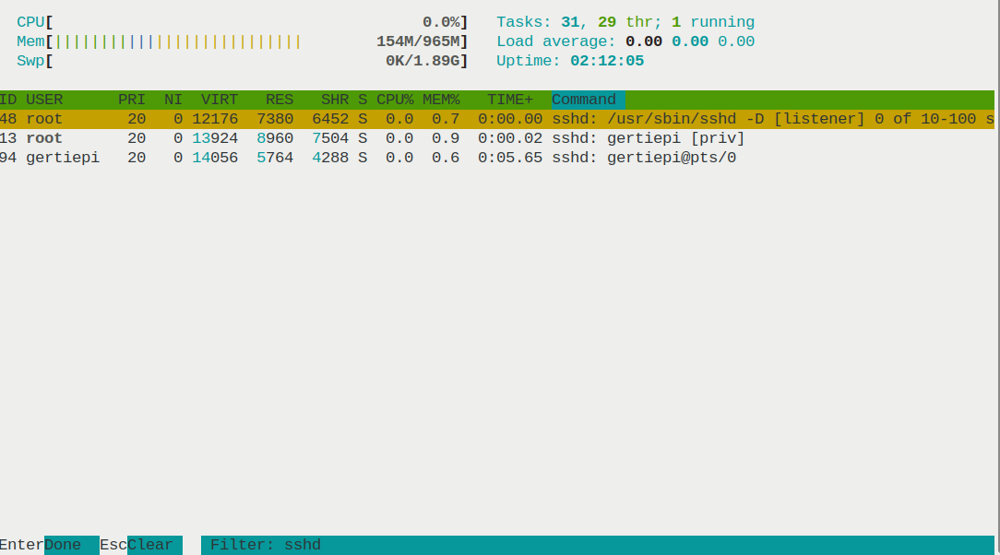
  
- Процесс `syslog`, найденный, используя поиск: \
\
  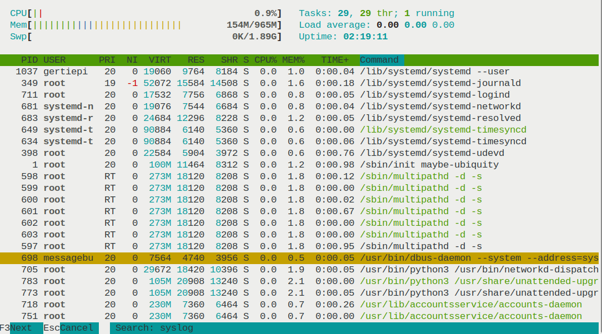
  
- С добавленым выводом `hostname`, `clock` и `uptime`: \
\
  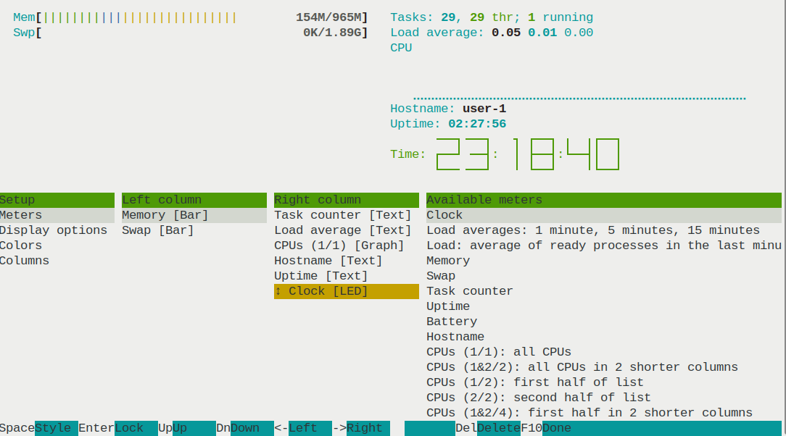

- ## Часть 10. Использование утилиты fdisk

- Команда `fdisk -l` позволяет получить информацию о жестком диске: \
\
  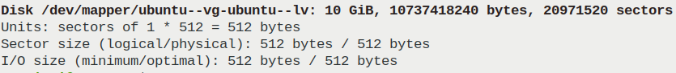

| Параметр | Значение |
| --------------------| ------------ |
| название жесткого диска | `/dev/mapper/ubuntu--vg-ubuntu--lv` |
| размер | 10 Gib |
| количество секторов | 20971520 |
| размер swap | 1.9 G |

- ## Часть 11. Использование утилиты df

- Команда `df` (выводит информацию в блоках по 512 байт) позволяет получить информацию о дисковом пространстве: \
\
  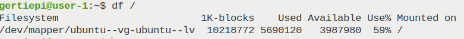
- Для корневого раздела параметры будут следующие:
  

| Параметр | Значение |
| ---------| -------- |
| размер раздела | 10218772 |
| размер занятого пространства | 5690120 |
| размер свободного пространства | 3987980 |
| процент использования | 59% |
| тип файловой системы | ext4 | 

- Команда `df -Th` : \
\
  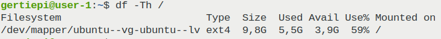
- Для корневого раздела параметры будут следующие:
  
| Параметр | Значение |
| ---------| -------- |
| размер раздела | 9.8G |
| размер занятого пространства | 5.5G |
| размер свободного пространства | 3.9G |
| процент использования | 59% |
| тип файловой системы | ext4 | 

## Часть 12. Использование утилиты du
  
- Еще одна команда для получения информации о дисковом пространстве `du`: \
\
  
  
- Вывод размера папок `du -bh pathname`
  
- Вывод размера папок `/home`: \
\
  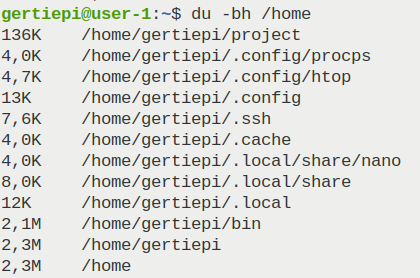
- Вывод размера папок `/var`: \
\
  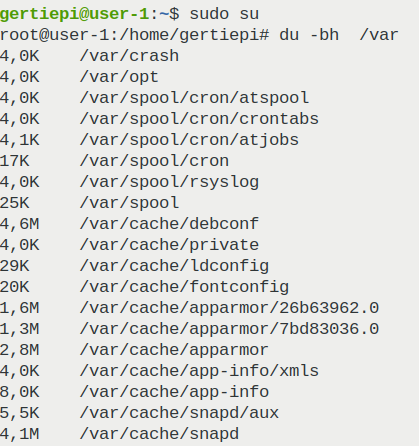
- Вывод размера папок `/var/log`: \
\
  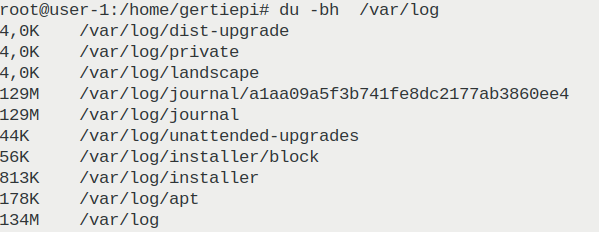

- Вывод размера всего содержимого в `/var/log`: \
\
  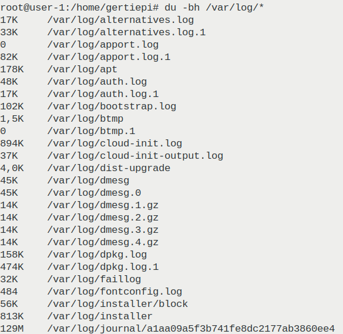

## Часть 13. Установка и использование утилиты ncdu

- Для улучшения визуальной состовляющей команды `du` существует команда `ncdu`
- Размер папки `/home`: \
\
  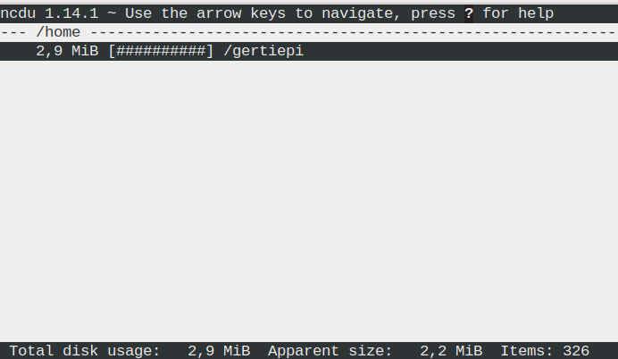

- Размер папки `/var`: \
\
  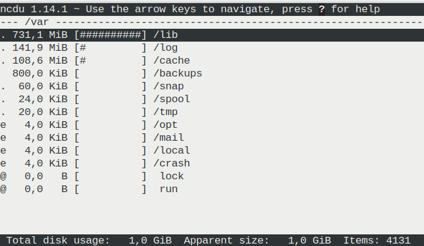

- Размер папки `/var/log`: \
\
  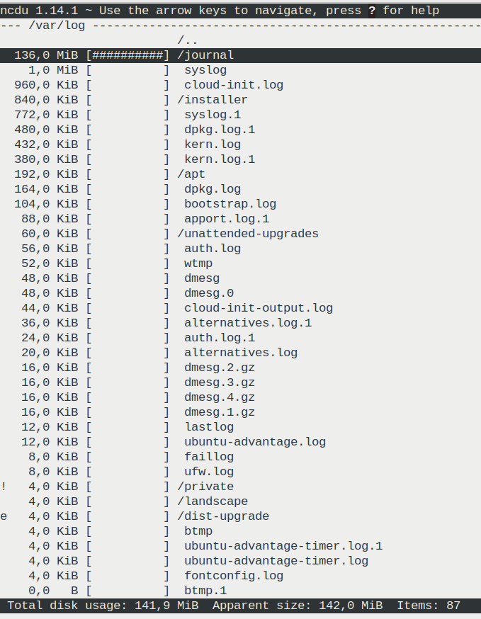

## Часть 14. Работа с системными журналами

- Команда `tail /var/log/auth.log`: \
\
  

- Время последней успешной авторизации - `Jun 23 03:51:04`
- Имя пользователя - `gertiepi`
- Метод входа в систему - `ssh`

- После рестарта сервиса `ssh` соответствующий лог можно найти командой  `tail /var/log/syslog`: \
\
  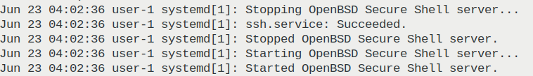

## Часть 15. Использование планировщика заданий CRON

- С использованием утилиты `crontab` спланирован запуск командф `uptime` через каждые 2 минуты: \
\
  

  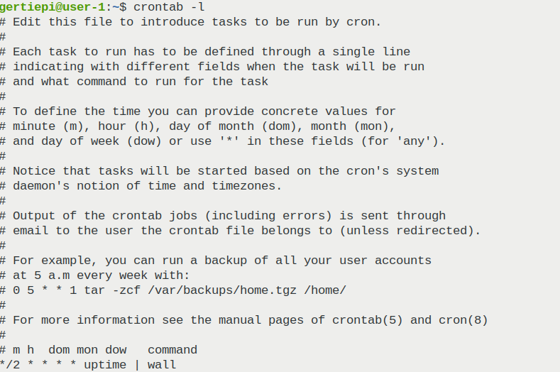

