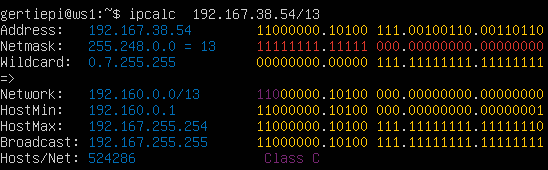
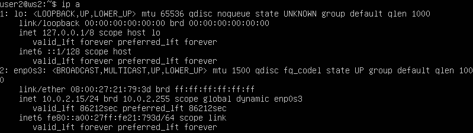
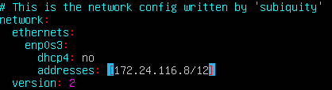
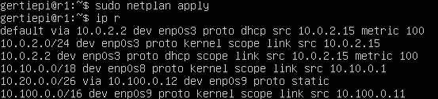
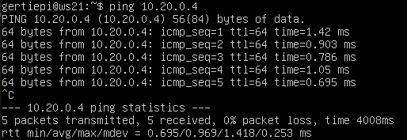
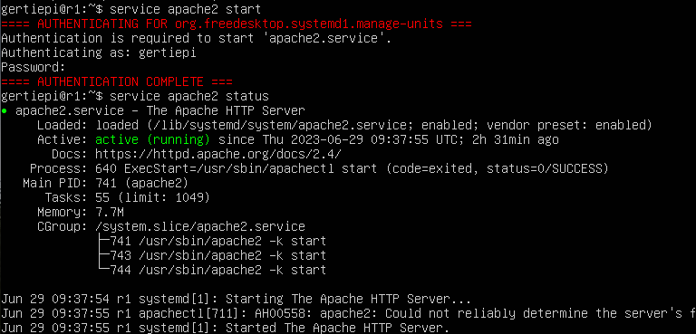

# Сети в Linux.
Настройка сетей в Linux на виртуальных машинах.

## Часть 1. Инструмент ipcalc
### 1.1. Сети и маски
Информацию об `ip` можно получить вызвав команду `ipcalc`: \

#### 1.1.1. Определение адреса сети
Для того чтобы узнать адрес сети хоста с `IP` `192.167.38.54/13` требуется поразрядно перемножножить двоичные представления маски подсети и `IP`-адреса какого-либо хоста той же сети. 
    
Адрес сети хоста `192.160.0.0/13`.

#### 1.1.2. Различные формы представления масок

| Обычная | Префиксная | Двоичная |
| --------| ---------- |--------- |
| 255.255.255.0 | /24 | 11111111.11111111.11111111.00000000 |
| 255.254.0.0 | /15 | 11111111.1111111 0.00000000.00000000 |
| 255.255.255.240 | /28 | 11111111.11111111.11111111.11110000 |

#### 1.1.3. Минимальные, максимальные размеры хостов

`IP` хоста в сети `12.167.38.4`, маска `/8`: \

`IP` хоста в сети `12.167.38.4`, маска `11111111.11111111.00000000.00000000`: \

`IP` хоста в сети `12.167.38.4`, маска `255.255.254.0`: \

`IP` хоста в сети `12.167.38.4`, маска `/4`: \

### 1.2. localhost

`IP` адреса к которым можно обратиться по `localhost`: `127.0.0.2`, `127.1.0.1`. \

`IP` адреса к которым нельзя обратиться по `localhost`: \
`194.34.23.100` \

`128.0.0.1` \

### 1.3. Диапазоны и сегменты сетей

*Частный `IP`-адрес (Private `IP` address)* - это адрес, который используется для идентификации устройства в локальной сети. Он предназначен для использования внутри частных сетей и не маршрутизируется через интернет.\
*Публичный `IP`-адрес (Internet Protocol address)* - это уникальный идентификатор, присвоенный устройству в сети Интернет. Он используется для обмена данных между устройствами в глобальной сети.\
Диапазоны частных `IP` адресов: 
- Класс А: `10.0.0.0` – `10.255.255.255`
- Класс Б: `172.16.0.0` – `172.31.255.255`
- Класс С: `192.168.0.0` – `192.168.255.255`

*Шлюз (gateway)* - это сетевое устройство, которое обеспечивает связь между различными сетевыми сегментами или сетями. Он выполняет роль промежуточного узла, через который проходит сетевой трафик между сетями.

#### 1.3.1. Классификация `IP` адресов

К публичным относятся следующие `IP` адреса: \
  `134.43.0.2` \

 `172.0.2.1` \

 `192.172.0.1` \

 `172.68.0.2` \

 `192.169.168.1` \

К частным относятся следующие `IP` адреса: \
`10.0.0.45` \

`192.168.4.2` \

`172.20.250.4` \

`172.16.255.255` \

`10.10.10.10` \

#### 1.3.2. Доступные `IP` адреса шлюза
Диапазон `IP` адресов шлюза сети `10.10.0.0/18`:

Из перечисленных ему доступны следующие `IP` адреса из перечисленных: `10.10.0.2`, `10.10.10.10`, `10.10.1.255`.

## Часть 2. Статическая маршрутизация между двумя машинами

*Маршрутизация (Routing)* - это процесс передачи данных в сети от отправителя к получателю через промежуточные узлы, называемые маршрутизаторами или шлюзами. Она является основной функцией сетевых устройств, которые обеспечивают связь между различными сетями.

*Статическая маршрутизация (Static Routing)* - это метод установки маршрутов в сети вручную, вручную указывая конкретные пути для передачи пакетов данных. При использовании статической маршрутизации сетевой администратор явно определяет маршруты в таблице маршрутизации каждого маршрутизатора или сетевого устройства.
### 2.0. Настройка машин

Существующие сетевые интерфейсы `ws1`: \

Существующие сетевые интерфейсы `ws2`: \

Настройка сетевых интерфейсов `ws1`: \

Настройка сетевых интерфейсов `ws2`: \

Приминение настроеной конфигурации для `ws1`: \

Приминение настроеной конфигурации для `ws2`: \

Сетевые интерфейсы после настройки:

Сетевые интерфейсы `ws1`: \

Сетевые интерфейсы `ws2`: \

### 2.1. Добавление статического маршрута вручную

Настройка статического маршрута вручную для `ws1`: \

Настройка статического маршрута вручную для `ws2`: \

### 2.2. Добавление статического маршрута с сохранением

Настройка статического маршрута с сохранением для `ws1`: \

Настройка статического маршрута с сохранением для `ws2`: \

Проверка соединения (пинг):

`ws1` пинг `ws2`\

`ws2` пинг `ws1`\

## Часть 3. Утилита iperf3
*`Iperf3`* — это инструмент для измерения пропускной способности сети, который позволяет оценить пропускную способность и характеристики сетевого соединения между двумя узлами. Он является потомком популярного инструмента `iperf`, который предоставлял аналогичные функции.

`Iperf3` работает в клиент-серверной модели, где один узел выступает в роли сервера, а другой — в роли клиента. Клиент генерирует сетевой трафик и отправляет его на сервер, который затем измеряет пропускную способность, задержку и другие параметры соединения.

`Iperf3` может быть использован для различных целей, включая:
- Измерение пропускной способности сети между двумя узлами.
- Оценка задержки (пинга) и потерь пакетов в сети.
- Тестирование и настройка сетевых устройств и маршрутизаторов.
- Оптимизация настроек сети для достижения наилучшей производительности.

### 3.1. Скорость соединения

- 8 Mbps = 1 MB/s 
- 100 MB/s  = 800 000 Kbps
- 1 Gbps = 1 000 Mbps
### 3.2. Утилита iperf3

Для измерения скорости соединения между машинами `ws1` и `ws2`, 
машина `ws1` запускается в режиме сервера, а машина `ws2` в режиме клиента: \
`ws1` (сервер) \

`ws2` (клиент) \

## Часть 4. Сетевой экран
*Сетевой экран (англ. firewall)* - это система, которая используется для защиты компьютерной сети или отдельных узлов от несанкционированного доступа и потенциально вредоносной активности. Он представляет собой барьер, контролирующий поток сетевого трафика и решающий, какие пакеты данных разрешены или блокируются на основе определенных правил и настроек.

*`Iptables`* - это утилита командной строки в Linux, которая предоставляет интерфейс для настройки и управления сетевым экраном (firewall) в ядре Linux. `Iptables` является частью подсистемы Netfilter, которая предоставляет возможности фильтрации и манипулирования сетевыми пакетами в Linux.

*`Nmap` (Network Mapper)* - это утилита сканирования сети, которая используется для исследования и проверки безопасности компьютерных сетей. Она предоставляет возможность анализировать хосты и порты в сети, определять открытые порты, определять операционные системы, обнаруживать службы и многое другое.
### 4.1. Утилита iptables

Содержание настроенного файла конфигурации `/etc/firewall.sh` на машине `ws1`:

Содержание настроенного файла конфигурации `/etc/firewall.sh` на машине `ws2`:

Результат запуска файла `/etc/firewall.sh` на машине `ws1`:

Результат запуска файла `/etc/firewall.sh` на машине `ws2`:

Различие между стратегиями, примененными в первом и втором файлах, заключается в следующем: в случае использования утилиты `iptables`, правила выполняются в порядке, идущем сверху вниз. На первой машине в файле сначала указано запрещающее правило для исходящих соединений, что означает, что она не сможет выполнить пинг до другой машины. В то же время, на второй машине первым указано разрешающее правило, что означает, что она сможет выполнить пинг до другой машины.

### 4.2. Утилита nmap
`ws1` пинг `ws2`: \

`ws2` пинг `ws1`: \

В firewall.sh файле для второй машины в начале было добавлено запрещающее правило, из-за чего невозможно выполнить пинг до нее. \
Для подтверждения того, что хост машины работает, воспользуемся инструментом `nmap`:

## Часть 5. Статическая маршрутизация сети

### 5.1. Настройка адресов машин

Настройка конфигурации машины `r1`: \

Настройка конфигурации машины `r2`: \

Настройка конфигурации машины `w11`: \

Настройка конфигурации машины `w21`: \

Настройка конфигурации машины `w22`: \

Проверка правильности настроек конфигурации: 

`r1`\

`r2`\

`w11`\

`w21`\

`w22`\

Пинг `ws22` с `ws21`: \

Пинг `r1` с `ws11`: \

### 5.2. Включение переадресации IP-адресов

Включение переадресации без сохранения: \

Включение переадресации c сохранением изменений: \

### 5.3. Установка маршрута по-умолчанию
Настройка маршрута по-умолчанию (шлюз) для рабочих станций:\
`w11`\

`w21`\

`w22`\

Проверка добавления маршрута в таблицу маршрутизации:\
`w11`\

`w21`\

`w22`\

Пинг с `ws11` роутера `r2`:\

Машина `ws11`\

Машина `r2`\

Ответ на пинг не доходит до машины `ws11`,так как машина `r2` не знает по какому адресу отправить ответ, но пинги до `r2` доходят.\

### 5.4. Добавление статических маршрутов
Настройка `r1`:\

Настройка `r2`:\

Таблица маршрутизации `r1`:\

Таблица маршрутизации `r2`:\

Маршрутизация `w11`:\

Для адреса `10.10.0.0/18` был выбран маршрут, отличный от `0.0.0.0/0` (он попадает под маршрут по-умолчанию), т.к. машина `ws11` соединена с сетью `10.10.0.0/18` по своему IP-адресу `10.10.0.2`, для других адресов используется маршрут по умолчанию, который указан в файле `10.10.0.1`.

### 5.5. Построение списка маршрутизаторов
Список маршрутизаторов на пути от `ws11` до `ws21`:\

Результат работы дампа на `r1`:\

*Traceroute (или трассировка маршрута)* - это утилита, которая позволяет определить путь, который сетевой пакет проходит от отправителя к получателю через сеть. Она основана на использовании ICMP пакетов (Internet Control Message Protocol) и TTL (Time to Live) поля в заголовке IP пакетов.

Принцип работы traceroute следующий:

1. Traceroute отправляет специально сформированные ICMP Echo Request пакеты с постепенно увеличающимся значением TTL в заголовке IP пакета.

2. TTL представляет собой счетчик, который указывает, сколько маршрутизаторов может пройти пакет, прежде чем он будет отброшен. Изначально TTL установлен на 1.

3. Когда пакет достигает первого маршрутизатора на пути, TTL уменьшается на 1, и маршрутизатор отправляет обратно ICMP Time Exceeded сообщение отправителю. Это сообщение указывает, что пакет не может дальше продвигаться из-за достижения предела TTL.

4. Отправитель, получив Time Exceeded сообщение, знает, что первый маршрутизатор на пути был найден, и записывает IP-адрес этого маршрутизатора.

5. Traceroute повторяет этот процесс, каждый раз увеличивая значение TTL на 1, чтобы найти следующий маршрутизатор на пути к конечному пункту назначения.

6. Когда ICMP Echo Request пакет достигает конечного пункта назначения, получатель отправляет ICMP Echo Reply пакет обратно отправителю.

7. Таким образом, отправитель может отслеживать путь до конечного пункта назначения, записывая IP-адреса промежуточных маршрутизаторов, отвечающих на ICMP Time Exceeded сообщения.

8. Traceroute продолжает этот процесс до достижения максимального количества прыжков (hops) или до получения ICMP Echo Reply от конечного пункта назначения.

В результате traceroute строит список IP-адресов промежуточных маршрутизаторов и измеряет время, затраченное на прохождение пакетов через каждый маршрутизатор. Это позволяет определить задержки и проблемы в сети на пути от отправителя к получателю.

### 5.6. Использование протокола ICMP при маршрутизации

Перехват пакетов на `r1`:\

Пинг с `ws11`:\

## Часть 6. Динамическая настройка IP с помощью DHCP

*`DHCP` (Dynamic Host Configuration Protocol)* - это сетевой протокол, который позволяет компьютерам и другим сетевым устройствам автоматически получать `IP`-адрес, настройки сети и другие параметры сетевой конфигурации от `DHCP`-сервера.

Основная цель `DHCP` - облегчить процесс настройки сети для устройств, подключающихся к сети. Вместо того, чтобы вручную настраивать `IP`-адрес, подсеть, шлюз по умолчанию и другие параметры для каждого устройства вручную, `DHCP` автоматически назначает эти значения устройствам, когда они подключаются к сети.

### 6.1. Настройка службы DHCP
Настройка адреса маршрутизатора по-умолчанию, DNS-сервера и адреса внутренней сети на машине `r2`: 

Перезагрузка службы `DHCP`:\

Настройка конфигурации `ws21`:\

Настройка конфигурации `ws22`:\

Проверка получения `IP` адресса:\
`ws21`\

`ws22`\

Проверка соединения между `ws21` и `ws22`:\

### 6.2. MAC-адрес
Настройка MAC-адресса:\
`w11`\

Настройка `r1` с выдачей адресов  с жесткой привязкой к MAC-адресу (ws11):\
Файл /etc/dhcp/dhcpd.conf\

Файл /etc/resolv.conf\

Статус сервиса `isc-dhcp-server`:\

Проверка корректного назначения `ip` машине `ws11`:\

Проверка соединения (`ws22` пингует `ws11`):\

### 6.3. Обновление `ip` 

`IP` машины `ws21` до обновления:\

Удаление старого `ip`:\

`IP` машины `ws21` после обновления:\

Были применены следующие опции DHCP протокола:

- Опция routers `ip-address` - указывает адреса шлюзов для клиентской сети. Список маршрутизаторов должен быть упорядочен по предпочтительности.
- Опция `domain-name-servers ip-address`  - перечисляет доступные клиенту DNS серверы. Серверы должны быть упорядочены по приоритету.

## Часть 7. NAT
*SNAT (Source Network Address Translation)* - это технология, используемая в компьютерных сетях для изменения и перевода исходного `IP`-адреса отправляемых сетевых пакетов. Она является одной из форм Network Address Translation (`NAT`).

`SNAT` применяется на маршрутизаторах или брандмауэрах и позволяет изменять исходный `IP`-адрес пакетов, проходящих через него, перед отправкой их на удаленный узел в сети. Это полезно, когда устройства в локальной сети с использованием приватных `IP`-адресов нуждаются в доступе к ресурсам во внешней сети, такой как Интернет.

Когда пакет проходит через устройство с настроенным `SNAT`, исходный `IP`-адрес в заголовке пакета заменяется на публичный `IP`-адрес, присвоенный устройству для коммуникации с внешней сетью. Это позволяет устройствам с приватными `IP`-адресами отправлять пакеты во внешнюю сеть и получать ответы обратно.

### 7.1. Настройка сервера Apache2

Настройка конфигурационного файла на машинах  `w22` и `r1`:\

Запуск веб-сервера на машинах `w22` и `r1`:\
машина `w22`\

машина `r1`\

### 7.2. Настройка фаервола на r2

Создание фаервола на мащине `r2`:\

файл `/etc/faerwall.sh`\

Запуск фаервола:\

Проверка работы фаервола (пинг `ws22` с `r1`):\

Проверка работы фаервола (пинг `r1` с `ws22` ):\

Настройка  разрешения маршрутизации всех пакетов протокола ICMP:\
Машина `r2`, файл `/etc/firewall.sh`\

Запуск фаервола:\

Проверка работы фаервола (пинг `ws22` с `r1`):\

Проверка работы фаервола (пинг `r1` с `ws22` ):\

Пинги между машинами проходят, значит фаервол на `r2` успешно их пропускает.

### 7.3. Настройка SNAT и DNAT

Для настройки понадобится добавить еще 2 правила в фаервол:

Машина `r2`, файл `/etc/faerwall.sh`\

Запуск фаервола:\

Проверка соединения по `TCP` для `SNAT` (с `ws22` подключение к серверу `Apache` на `r1`):\

Проверить подмену `IP`-адреса можно с помощью команды `tcpdump` - пингуем с машины `ws22` роутер `r1`, в выводе `tcpdump` будет отображаться с какого адреса идет запрос - `IP`-адрес `r2`.

## Часть 8. Дополнительно. Знакомство с SSH Tunnels

Настройка конфигурации `apache2`:\
Машина `w22`\

