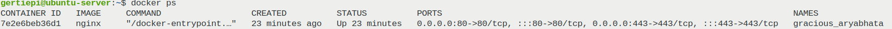
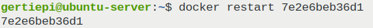

# Simple Docker
Введение в докер. Разработка простого докер образа для собственного сервера.

## Часть 1. Готовый докер
Загрузка образа, команда `docker pull`: \

Получить список скачанных образов с их описанием, команда `docker images`: \

Запуск докер образа, команда `docker run -d [image_id|repository]`: \

Проверка запущенных контейнеров, команда `docker ps`: \

Получение подробной информации о контейнере, команда `docker inspect [container_id|container_name]`: \

Остановка работы контейнера, команда `docker stop [container_id|container_name]`: \

Проверка остановки контейнера: \

Запуск контейнера с мапингом портов `80` и `443`: \

Проверка запущенного контейнера: \

Проверка роботоспособности веб-сервера `nginx`: \

Перезапуск докер контейнера, команда `docker restart [container_id|container_name]`: \

## Часть 2. Операции с контейнером
Чтение конфигурационнго файла `nginx.conf`, внутри докер контейнера, команда `exec`: \

Настройка конфигурационного файла: по пути `/status` отдачу страницы статуса сервера `nginx`: \

Копирование файла `nginx` в докер контейнер: \

Перезапуск веб сервера `nginx`: \

Проверка обработки адреса `localhost:80/status`: \

Экспорт контейнера в архив `container.tar`, команда `export`: \

Удаление образа `nginx` при запущенном контейнере, команда `docker rmi [image_id|repository]`: \

Удаление контейнера `server_nginx`, команда `docker rm`: \

Импорт удаленного контейнера обратно, команда `import`: \

Запуск и проверка импортированного контейнера: \

Часть 3. Мини веб-сервер

